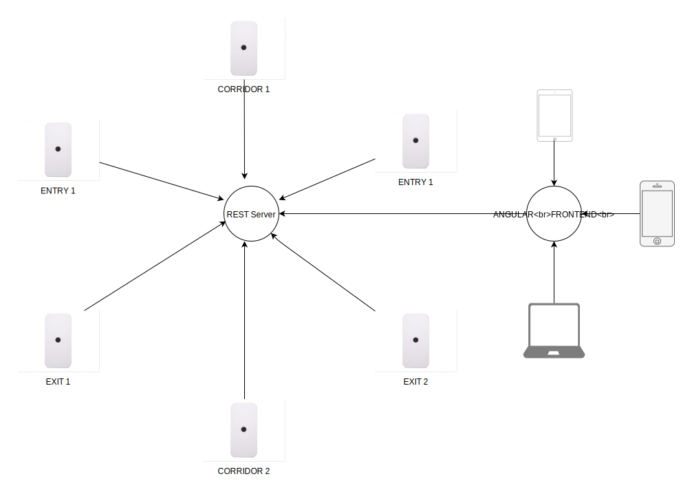
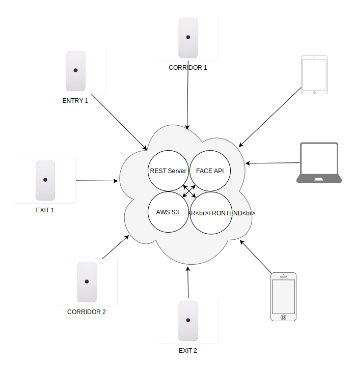
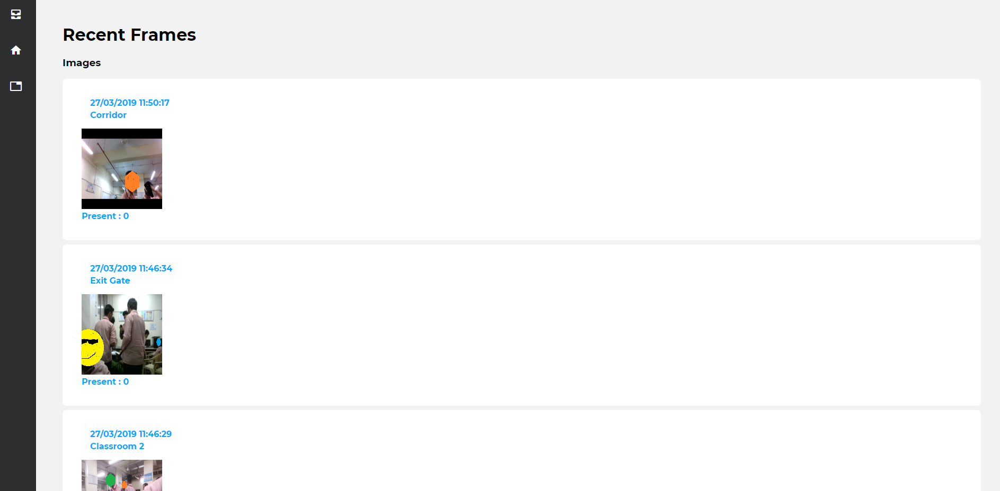
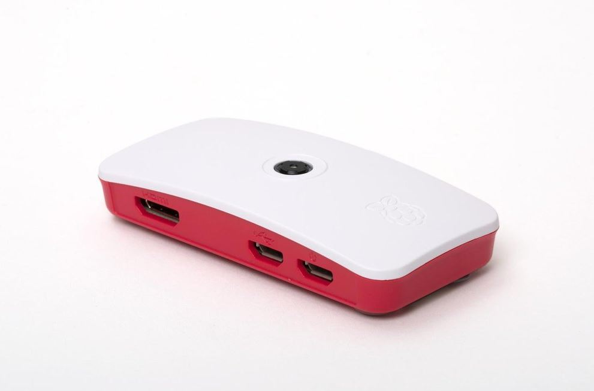

# Facial Recognition Attendance System using Deep Learning with Microsoft FaceAPI, Django and Raspberry Pi-es! 

### F.R.A.S!

Other than being a mouthful to say; 
_FRAS_ allows **tens of facial-recognition-camera-clients** aka tiny *Raspberry Pi-es* to be deployed all across a college, 
or an industrial campus, which then record who they see and when they see then to a central database.

The entire system runs for dirt cheap on cloud using [Microsoft Face API](https://azure.microsoft.com/en-us/services/cognitive-services/face), [Heroku](https://fras-1.herokuapp.com) and [AWS S3](https://aws.amazon.com/s3) and using multiple [Raspberry Pi Zeros](https://www.raspberrypi.org/products/raspberry-pi-zero), which cost about **15**-**17$**

## How does it work? 

#### Dystopian node-based Facial Recognition in 5 simple steps.

1. A [Django REST Server](<https://github.com/CT83/Facial-Recognition-Attendance-System/tree/master/django-server>), with a **PostGres Database** runs on [Heroku](https://fras-1.herokuapp.com).
2. A **15$** [Raspberry Pi Zero](https://www.raspberrypi.org/products/raspberry-pi-zero) with a [Camera Module](https://www.raspberrypi.org/products/camera-module-v2) and internet connection is placed at any location - entrances, exits, hallways
3. The **Raspberry Pi** - *Camera Client* takes an image at regular intervals and sends this to [Microsoft Face API](https://azure.microsoft.com/en-us/services/cognitive-services/face), which tells <u>who-is-who</u> in the image.
4. The *Camera Client* then sends the names of recognized persons to the **REST Server** for storage with the captured images which are sent to [AWS S3](https://aws.amazon.com/s3) for storage.
5. [Angular Frontend](https://fras-ui.herokuapp.com) allows users to view the stored data.

> This was my high school's final semester project on which I barely spent 48 hours building. The REST Server and 
Angular proved to be quite an undertaking! But, the professor seems pleasantly surprised with what 
I built so it all ended just fine. :)

## Architectural Overview

### Basic Architecture

Every Camera Client is responsible for recognizing all of the faces on it’s own and communicating with the **Microsoft Face API** as well as saving the images to S3, also the users connected to the Angular Client can also need to see the uploaded images, so everything ends up looking like this.

### User Interface

#### Main Page

The Main Page shows the list of all registered people, **Face API** is sent about ~20 images of each person during the initial setup. 

#### Person Details

Selecting one of the persons allows you to see where they were last seen, how many days they were present, and more

#### Recent Images

Shows the most recently captured images from all Camera Clients

#### Attendance Table  

Shows a list of all dates and number of present people, selecting one of them takes you to the next page.

#### Working Day Details

Shows all of the lectures which were held that day in school, and how many people were present for those.

#### Lecture Details

Shows how many students were present for that particular lecture.

## Hardware

### Raspberry Pi Zero - Camera Module

#### Add a 5$ Case and Viola!

## How do I run it? -- Ehh

This is a high level description of what you could do, but feel free to hit me up on Hangouts at rohansawantct83@gmail.com if you are interested in getting something like this up and running.
1. [Setup Microsoft Face API](https://docs.microsoft.com/en-us/azure/cognitive-services/Face/Tutorials/FaceAPIinPythonTutorial) 
2. [Build OpenCV on a Raspberry Pi Zero](https://www.pyimagesearch.com/2015/12/14/installing-opencv-on-your-raspberry-pi-zero)
3. [Setup up Django Server on Heroku](https://devcenter.heroku.com/articles/deploying-python)
4. [Setup Angular Frontend on Heroku](https://medium.com/@hellotunmbi/how-to-deploy-angular-application-to-heroku-1d56e09c5147)
5. [Setup AWS S3](https://www.whizlabs.com/blog/aws-s3/)

## Problem that I started out to solve

On one rainy day in July, I dejectedly shook my head at the distressed professor who stared back at me, wondering where half of the class was? I shrugged helplessly, and went back to daydreaming about the Black Mirror episode which I watched earlier that day. The school had tried everything, taking attendance twice during lectures, making everyone sign a piece of paper passed around the class, fining for those who remained absent … you name it. All of these seemed like foolproof solutions to the problems according to the school’s middle management, me? I had my doubts. 

Lack of attendance in school during lectures…hmm, maybe AI could help me solve this, and helped me-solve-this it did, well at least on paper for the time being. 

YES! We could turn the college campus into a total surveillance state, monitor everyone, store everyone’s faces, track their every move, and use that to generate **helpful insights** to make the world a better place. 🙃

That was how everything started, there are still a lot of features which I left unexplored, *Face API* also provides support for emotion recognition…

Why? So we know our happy students from the sad ones? 

Maybe I could add activity recognition? That would help teachers pick the sleepiest of their pupils.

:down-the-rabbit-hole: 🐇

#### Moving on…

## Vision

In my worst nightmares, I imagine a highly sophisticated version of this running running on embedded devices like the [Nvidia Nano](https://www.nvidia.com/en-us/autonomous-machines/embedded-systems/jetson-nano/) - on every street corner, every shop and every stop light, the data could be continuously stored in on the blockchain with no central point of failure, as we try and hope hard that our [Funky-Glasses](https://www.theverge.com/2016/11/3/13507542/facial-recognition-glasses-trick-impersonate-fool) are enough to fool the cutting edge ML Models.   

